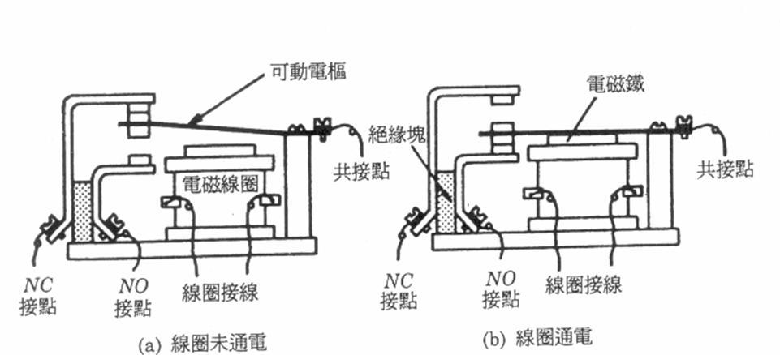

繼電器
由 Coil 的電壓決定 COM 跟 NO 或 NC 導通

## Pin

- 線圈（Coil）
- COM（Common）表示共接點
- NO（Normally Open）表示常開接點（俗稱A接點）。平常處於開路（斷路），線圈通電後才成為閉路（與共接點COM接通）
- NC（Normally Closed）表示常閉接點（俗稱B接點）。平常處於閉路（與共接點COM接通），線圈通電後才成為開路（斷路）

I, Wasami007, CC BY-SA 2.5, https://commons.wikimedia.org/w/index.php?curid=2431299
