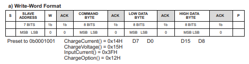
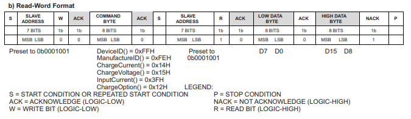

## 德州儀器的 Battery Charge Controller

支援用 I2C 設定最大充電電壓及電流，並提供電路保護

> Enhanced safety features for over voltage protection, over current protection, battery, inductor and MOSFET short circuit protection
> BQ24725A 使用兩個電荷泵分別驅動 n 通道 MOSFET（ACFET、RBFET 和 BATFET），以實現自動系統電源源選擇。

- Charge Voltage 1.024 ~ 19.2 V
- Charge Current 0.128~ 8.128 A
- AC Adapter Input Voltage 4.5V ~ 24V

## I2C 寫入格式

## I2C 讀取格式

## I2C Command

設置不合法的值會被設回預設值
如果長時間沒有由 I2C 寫入充電電壓或充電電流會停止充電

### 0x12 ChargeOption

Read or Write
Charger Options Control
Default 0xF902

- Bit 0 Charge Inhibit
  - 0: Enable Charge default
  - 1: Inhibit Charge
    充電總開關，預設會開，但預設電壓電流為零所以還是不會充
- Bit 14:13 WATCHDOG Timer Adjust
  - 00: Disable Watchdog Timer
  - 01: Enabled, 44 sec
  - 10: Enabled, 88 sec
  - 11: Enable Watchdog Timer (175s) default
    設定連續 SMBus 寫入充電電壓或充電電流命令之間的最大延遲時間。如果在看門狗計時器啟用的情況下，IC 未在看門狗時間期限內接收到寫入充電電壓或充電電流的命令，則充電將會暫停。
    當看門狗計時器超時且充電暫停後，接收到寫入充電電壓或充電電流命令時，充電將會恢復。

### 0x14 ChargeCurrent

Read or Write
7-Bit Charge Current Setting (最大值，最大努力，不保證)
Default 0x0000
the BQ24725A provides a charge current range of 128mA to 8.128A, with 64mA step resolution

- Bit 12 Charge Current, DACICHG 6 R/W
  - 0 = Adds 0mA of charger current.
  - 1 = Adds 4096mA of charger current.
- Bit 11 Charge Current, DACICHG 5 R/W
  - 0 = Adds 0mA of charger current.
  - 1 = Adds 2048mA of charger current.
- Bit 10 Charge Current, DACICHG 4 R/W
  - 0 = Adds 0mA of charger current.
  - 1 = Adds 1024mA of charger current.
- Bit 9 Charge Current, DACICHG 3 R/W
  - 0 = Adds 0mA of charger current.
  - 1 = Adds 512mA of charger current.
- Bit 8 Charge Current, DACICHG 2 R/W
  - 0 = Adds 0mA of charger current.
  - 1 = Adds 256mA of charger current.
- Bit 7 Charge Current, DACICHG 1 R/W
  - 0 = Adds 0mA of charger current.
  - 1 = Adds 128mA of charger current.
- Bit 6 Charge Current, DACICHG 0 R/W
  - 0 = Adds 0mA of charger current.
  - 1 = Adds 64mA of charger current.

設定值小於 128mA 時會被重設為預設值

### 0x15 ChargeVoltage

Read or Write
11-Bit Charge Voltage Setting(最大值，最大努力，不保證)
Default 0x0000
The BQ24725A provides charge voltage range from 1.024V to 19.200V, with 16mV step resolution

- Bit 4 Charge Voltage, DACV 0 R/W Set 1 to Adds 24mV of charger voltage.
- Bit 5 Charge Voltage, DACV 1 R/W Set 1 to Adds 25mV of charger voltage.
- Bit 6 Charge Voltage, DACV 2 R/W Set 1 to Adds 26mV of charger voltage.
- Bit 7 Charge Voltage, DACV 3 R/W Set 1 to Adds 27mV of charger voltage.
- Bit 8 Charge Voltage, DACV 4 R/W Set 1 to Adds 28mV of charger voltage.
- Bit 9 Charge Voltage, DACV 5 R/W Set 1 to Adds 29mV of charger voltage.
- Bit 10 Charge Voltage, DACV 6 R/W Set 1 to Adds 210mV of charger voltage.
- Bit 11 Charge Voltage, DACV 7 R/W Set 1 to Adds 211mV of charger voltage.
- Bit 12 Charge Voltage, DACV 8 R/W Set 1 to Adds 212mV of charger voltage.
- Bit 13 Charge Voltage, DACV 9 R/W Set 1 to Adds 213mV of charger voltage.
- Bit 14 Charge Voltage, DACV 10 R/W Set 1 to Adds 214mV of charger voltage.

### 0x3F InputCurrent

Read or Write
6-Bit Input Current Setting
Default 0x1000

### 0XFE ManufacturerID

Read Only
Manufacturer ID 0x0040

### 0xFF DeviceID

Read Only
Device ID 0x000B
