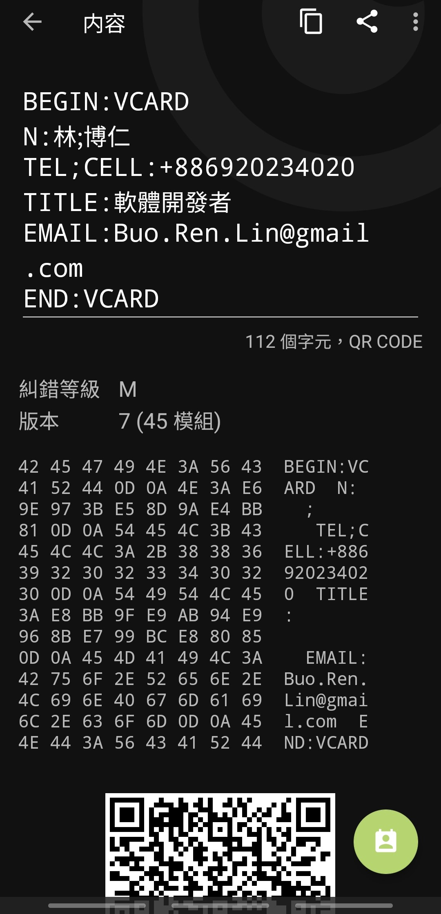
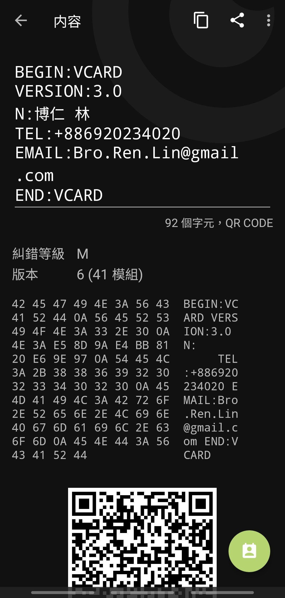

### 簡介

[vCard](https://en.wikipedia.org/wiki/VCard) 由 MIME 定義的電子名片格式

在 H4 聚會時發現某社群朋友的 QrCode 名片在 iphone 上會亂碼，無聊當起 RFC 警察來研究是哪一方不照標準實作
經朋友確認，讓我發它的個資上 blog 歡迎去他的[個人網站](https://www.brlin.me/)看看

### 編碼

先檢查編碼，檢查林字符的位子是 utf-8 在 [RFC 6350 3.1](https://datatracker.ietf.org/doc/html/rfc6350#section-3.1).  Charset 中確認編碼必須是 utf-8

### VERSION

用某網站做了一個一樣資訊的來比較，發現多了一個 VERSION ，在 [RFC 2426 3.6.9](https://datatracker.ietf.org/doc/html/rfc2426#section-3.6.9) VERSION Type Definition 中發現

> Type special notes: The property MUST be present in the vCard object.
> The value MUST be "3.0" if the vCard corresponds to this
> specification.
> Type example:
> VERSION:3.0

顯然標準要求版本號一定要填

[RFC 6350 6.7.9](https://datatracker.ietf.org/doc/html/rfc6350#section-6.7.9).  VERSION，vCARD VERSION 4.0 也要求一定要填，而且需要跟在 vCARD 之後。

[RFC 6868](https://datatracker.ietf.org/doc/html/rfc6868) 中禁用了一些 utf-8 字符，不過本事件沒有用到
