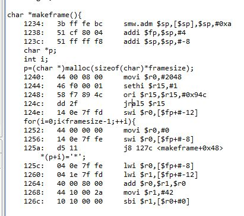
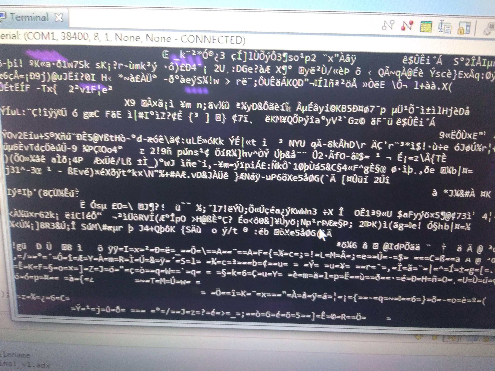

## 目的

我致敬了google的小恐龍


先示範

## lcd版

```c
#include <stdlib.h>
#include "WT59F064.h"
#include "lcd.h"
#include "keyboard_io.h"

int cactus[2]={0xffff,0xffff},djmp=0,score=0,gameover=0;

char trans(int i){
	if(i<10){
		return '0'+i;
	}else{
		return 'A'+(i-10);
	}
}

void ISR_forward(){
	TIM0_CNT = 0;
	TIM0_OFIF |= BIT4;
	if(gameover==1){
		return;
	}
	if(TIM0_MAT0A>100){
		TIM0_MAT0A-=1;
	}
	WriteIns(0x0100);
	if(cactus[0]==0){
		cactus[0]=0xffff;
	}else if(cactus[0]<=0x0f00){
		cactus[0]-=0x0100;
	}
	if(cactus[1]==0){
		cactus[1]=0xffff;
	}else if(cactus[1]<=0x0f00){
		cactus[1]-=0x0100;
	}

	if(djmp>0){
		WriteIns(0x8300);
		WriteData('D');
		--djmp;
	}else{
		WriteIns(0xc300);
		WriteData('D');
	}

	if(cactus[0]<0x0f00){
		WriteIns(0xc000+cactus[0]);
		WriteData('C');
	}
	if(cactus[1]<0x0f00){
		WriteIns(0xc000+cactus[1]);
		WriteData('C');
	}

	WriteIns(0x8c00);
	WriteData(trans(((score&0xf000)>>12)));
	WriteData(trans(((score&0x0f00)>>8)));
	WriteData(trans(((score&0x00f0)>>4)));
	WriteData(trans((score&0x000f)));
	++score;
	return;
}

void Timer0_Initial(void)
{
	TIM0_CTL |= BITF;  // Timer Enable
	TIM0_CNT = 0; //incremented every (pscl + 1) of trigger source
	TIM0_PSCL = 23999; //°£ÀW­È
	TIM0_MAT0A = 1000; //Match mat0a register for output match mode
	TIM0_IE |= BIT4; // Interrupt enable for mat0a
	IE0_0 |= BIT3;  // 1: Enable Timer 0 interrupt
	TIM0_CTL |= BIT0; // Timer Start
	return;
}

void Timer1_Initial(void)
{
	TIM1_CTL |= BITF; // Timer Enable
	TIM1_CNT = 0; //incremented every (pscl + 1) of trigger source
	TIM1_PSCL = 23999; //°£ÀW­È
	TIM1_CTL |= BIT0;
	return;
}


void IntInitial(void)
{
	initIntr();
	GIE_ENABLE();
	return;
}

void PWM_Initial(void)
{
	GPIO_ACT_PD = 0xFFFB;//GPIO port D.2 enables the PWM function.
	PWM4_PWM7_BASE_CLK = 0x3; 	// MUC Clock = 24MHz  => 2MHz
	PWM4_PWM7_ENABLE = 0x40; 	//PWM6 enable
	return;
}

void quiet_PWM6(){
	PWM6_CLOCK=10;
	PWM6_PERIOD=0;
	PWM6_DUTY=0;
	return;
}

int main(){
	System_Control_00 = ( System_Control_00 | 0x000E);
	// High speed external Xtal clk selection(011:24MHz); 1: HSE oscillator on
	System_Control_04 = ( System_Control_04 | 0x0001);
	// 1: Select HSE as system clock source
	InitialLCD();			// LCD initial
	IntInitial(); 			// MCU interrupt initial
	PWM_Initial();
	Timer0_Initial();
	Timer1_Initial();

	quiet_PWM6();
	while(1){
		KeyScan();
		if(GetKeyScanV()==0xE7 && djmp<=0 ){
			djmp=3;
			PWM6_CLOCK=10;
			PWM6_PERIOD=346;
			PWM6_DUTY=173;
			delay1(65534);
			quiet_PWM6();


		}else if(GetKeyScanV()==0xEB){
			gameover=1;
			while(1){
				if(GetKeyScanV()== 0xED){
					gameover=0;
					break;
				}
				KeyScan();
			}
		}

		if(djmp<=0){
			if(cactus[0]==0x0300 || cactus[1]==0x0300){
				WriteIns(0x8300);
				WriteString("game over");
				gameover=1;
				while(1){;}
			}
		}
		if(cactus[0]>0x1000){
			if((TIM1_CNT%51)<3){
				cactus[0]=0x0f00;
			}
		}
		if(cactus[1]>0x1000 && cactus[0]!=0x0f00){
			if((TIM1_CNT%51)<17){
				cactus[1]=0x0f00;
			}
		}
		if(TIM1_CNT>0xefff){
			TIM1_CNT=0;
		}
	}
	return 0;
}

```

### 使用零件

LCD,中斷

### 應用技術

- 很不良的超長中斷
- 在中斷時調中斷計數器，所以會變快
- 用另外的時鐘當亂數

## Uart版

### 我幻想他應該長這樣

```C
#include<stdlib.h>
#include<stdio.h>
#include<time.h>
#define hight 24
#define len 80
#define signoff 2
#define framesize 2048
char cactus[70]={"  /-\\/-\\  \" | || | \"\\\\| || |// \\| || |/   | || |    | || |  "}; //10*6
char role[80]={" _______ |       ||  $ $  ||   @   || ( ~ ) ||       ||_______|"}; //9*7
int hang=0;

void sleep(int s){
    time_t pass=time(NULL);
    while(time(NULL)-pass<s){;}
    return;
}

char *makeframe(){
    char *p;
    p=(char *)malloc(sizeof(char)*framesize);
    for(int i=0;i<framesize-1;++i){
        *(p+i)=' ';
    }
    *(p+framesize-1)='\0';
    return p;
}


int endofscreen(){
    return (len+signoff)*hight;
}
int sat(char* f,unsigned short x,unsigned short y,char c){
    //printf("w_po:%d",x+(len+signoff)*y);
    if(x<len && y<hight){
        f[x+(len+signoff)*y]=c;
    }else{
        printf("sat overrange at (%d,%d)",x,y);
    }
    return 0;
}

struct disobj{
    unsigned short px,py,x,y;
    char *o;
    struct disobj *next;
};

typedef struct disobj disobj;

void initdisobj(disobj *o){
    o->px=0;
    o->py=0;
    o->x=0;
    o->y=0;
    o->o=NULL;
    o->next=NULL;
}

void setdisobj(disobj *obj,unsigned short px,unsigned short py,unsigned short x,unsigned short y,char *bm){
    obj->px=px;
    obj->py=py;
    obj->x=x;
    obj->y=y;
    obj->o=bm;
    return;
}

int cactuswork(disobj *o){
    if(hang>9){
        if(rand()%3==0){
            disobj *n=(disobj *)malloc(sizeof(disobj));
            initdisobj(n);
            setdisobj(n,len-10,hight-6,10,6,cactus);

            hang=0;
        }
    }
    while(o!=NULL){
        if(o->o==cactus){
            if(o->px>len*2){

            }else{
                o->px-=1;
            }

        }
        o=o->next;
    }
    hang++;
    return 0;
}

int layout(char *f,disobj *o){
    while(o!=NULL){
        for(int i=0;i+o->py<hight && i<o->y;++i){
            for(int j=0;j+o->px<len && j<o->x;++j){
                //printf("w_bm:%c %d %d ",o->o[j+(o->x)*i],j,i);
                sat(f,o->px+j,o->py+i,o->o[j+(o->x)*i]);
            }
        }
        o=o->next;
    }
}

void scanner(char *screen,int k){
    for(int i=0;i<hight;++i){
        for(int j=0;j<len;++j){
            if(j==k){
                sat(screen,j,i,'|');
            }else{
                sat(screen,j,i,' ');
            }
        }
    }
    return;
}

void scanendline(char *f,char *staff){
    for(int i=0;i<hight;i++){
        for(int j=0;j<signoff;j++){
            //printf("position:%d ",len*(i+1)+i*signoff+j);
            *(f+len*(i+1)+i*signoff)=*(staff+j);
        }
    }
    return;
}

int main(){
    int k=0;
    char *screen=makeframe();
    disobj *obj=(disobj *)malloc(sizeof(disobj)),*s;
    initdisobj(obj);
    setdisobj(obj,20,hight-9,9,7,role);
    s=obj;
    obj=(disobj *)malloc(sizeof(disobj));
    initdisobj(obj);
    setdisobj(obj,len-10,hight-6,10,6,cactus);
    s->next=obj;
    screen[endofscreen()]='\0';
    scanendline(screen," \n");
    scanner(screen,len+1);
    layout(screen,s);
    printf("\n%s",screen);

    while(k<40){
        s->next->px-=2;
        scanner(screen,len+1);
        layout(screen,s);
        printf("\n%s",screen);
        sleep(2);
        k++;
    }

    return 0x0;
}
```

disobj是單向鏈結，串起我要顯示的所有圖(bit map)
所有 frame 掛在單層的單節點樹上，節點有序

每一個畫面皆是把disobj上的bit map畫上frame，我只要動disobj就可以移動圖了

這code實作在~~美好~~x64 with linux4.2上
我只要改掉printf就移植~~完成~~

這幻想，看結果

```C
#include<stdlib.h>
#include "keyboard_io.h"
#include "WT59F064.h"
#include "Uart.h"
#include "lcd.h"
#define hight 25
#define len 65
#define signoff 2
#define framesize 2048
char cactus[70]={"  /-\\/-\\  \" | || | \"\\\\| || |// \\| || |/   | || |    | || |  "}; //10*6
char role[80]={" _______ |       ||  $ $  ||   @   || ( ~ ) ||       ||_______|"}; //9*7


char hexresult[4];
int djmp=0,dderect=0,score=0;

char *makeframe(){
    char *p;
    int i;
    p=(char *)malloc(sizeof(char)*framesize);
    for(i=0;i<framesize-1;++i){
        *(p+i)='*';
    }
    *(p+framesize-1)='\0';
    return p;
}


int endofscreen(){
    return (len+signoff)*hight;
}
int sat(char* f,unsigned short x,unsigned short y,char c){
    if(x<len && y<hight){
        f[x+(len+signoff)*y]=c;
    }else{
    	;
        //printf("sat overrange at (%d,%d)",x,y);
    }
    return 0;
}

struct disobj{
    unsigned short px,py,x,y;
    char *o;
    struct disobj *next;
};

typedef struct disobj disobj;

void initdisobj(disobj *o){
    o->px=0;
    o->py=0;
    o->x=0;
    o->y=0;
    o->o=NULL;
    o->next=NULL;
    return;
}

void setdisobj(disobj *obj,unsigned short px,unsigned short py,unsigned short x,unsigned short y,char *bm){
    obj->px=px;
    obj->py=py;
    obj->x=x;
    obj->y=y;
    obj->o=bm;
    return;
}

int layout(char *f,disobj *o){
	int i,j;
    while(o!=NULL){
        for(i=0;i+o->py<hight && i<o->y;++i){
            for(j=0;j+o->px<len && j<o->x;++j){
                sat(f,o->px+j,o->py+i,o->o[j+(o->x)*i]);
            }
        }
        o=o->next;
    }
    return 0;
}

void scanner(char *screen,int k){
	int i,j;
    for(i=0;i<hight;++i){
        for(j=0;j<len;++j){
            if(j==k){
                sat(screen,j,i,'|');
            }else{
                sat(screen,j,i,'*');
            }
        }
    }
    return;
}

void showframe(char *f){
	int i,j;
    for(i=0;i<hight;i++){
        for(j=0;j<len;j++){
        	DRV_PutChar(f[j+(len+signoff)*i]);
        }
        DRV_PutChar('\n');
        DRV_PutChar('\r');
        delay1(0xffff);
    }
    for(i=0;i<64;i++){
    	delay1(0xffff);
    }
    return;
}

inline char hexshow(int i){
	if(i<10){
		return '0'+i;
	}else{
		return 'A'+(i-10);
	}
}

void dectohex(int i){
	hexresult[3]=hexshow((i&0xf000)>>12);
	hexresult[2]=hexshow((i&0x0f00)>>8);
	hexresult[1]=hexshow((i&0x00f0)>>4);
	hexresult[0]=hexshow(i&0x000f);
	return;
}

int main(){
	System_Control_00 = ( System_Control_00 | 0x000E);
	System_Control_04 = ( System_Control_04 | 0x0001);
	InitialLCD();
	WriteIns(0x8000);
	DRV_UartInitial();
    char screen[framesize];
    disobj obj0,obj1,obj2,*s;
    initdisobj(&obj0);
    initdisobj(&obj1);
    initdisobj(&obj2);
    setdisobj(&obj0,20,hight-7,9,7,role);
    setdisobj(&obj1,len-10,hight-6,10,6,cactus);
    setdisobj(&obj2,len,hight-6,10,6,cactus);
    s=&obj0;
    obj0.next=&obj1;
    //obj1.next=&obj2;

    while(1){
    	scanner(screen,len+1);
    	layout(screen,s);
    	showframe(screen);
    	DRV_Putstr("\n\n\n\n\n\r");

    	KeyScan();
    	if(GetKeyScanV()==0xE7 && djmp<=0 ){
    		djmp=1;
    		dderect=0;
    	}else if(GetKeyScanV()==0xEB){
    		while(1){
    			if(GetKeyScanV()== 0xED){
    				break;
    			}
    			KeyScan();
    		}
    	}

    	if(djmp>0){
    		if(dderect==0 &&djmp<=15){
    			djmp++;
    			obj0.py=hight-(7+djmp);
    		}else if(dderect==0){
    			dderect=1;
    			djmp--;
    			obj0.py=hight-(7+djmp);
    		}else if(dderect==1){
    			djmp--;
    			obj0.py=hight-(7+djmp);
    		}
    	}

    	if(djmp<5 && obj1.px<29 && obj1.px>14){
    		int k;
    		DRV_Putstr("\n\n\n\n\n\r");
    		for(k=0;k<32;++k){
    			DRV_Putstr("game over\n\r");
    		}
    		while(1){;}
    	}

    	if(obj1.px==0){
    		obj1.px=len-10;
    	}else{
    		obj1.px-=1;
    	}

    } //end of main loop.

    return 0x0;
}
```

- frame的單層樹狀結構被改成直接指向char array
- 所有動態生成的物件，全寫死

### malloc


line 3有什麼問題??
p 呢

所以p是亂數??
是0

具規格書，那是保留，所以是0囉??

他會印出大概1000個是長的單一字元，可是我Uart一次只能送一個ascii
我每印一個char就加一個等號
我是應為她每次多差不多才發現的，她系統資源完全裸奔

這就是魔法

### 記憶體超界

他只有4096bit不小心超出去會停機
他後面是flash，我還不知道可不可以存取

### Uart buffer

```C
void showframe(char *f){
	int i,j;
    for(i=0;i<hight;i++){
        for(j=0;j<len;j++){
        	DRV_PutChar(f[j+(len+signoff)*i]);
        }
        DRV_PutChar('\n');
        DRV_PutChar('\r');
        delay1(0xffff);
    }
    for(i=0;i<64;i++){
    	delay1(0xffff);
    }
    return;
}
```

板子的Uart buffer不夠大，要延遲一下
傳送檢查的bit只是寫buffer

### 使用零件

Uart

## 修課心得

OS很偉大，真的
完程度大概有六成，至少不是屍體
