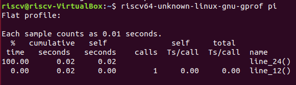
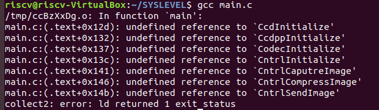
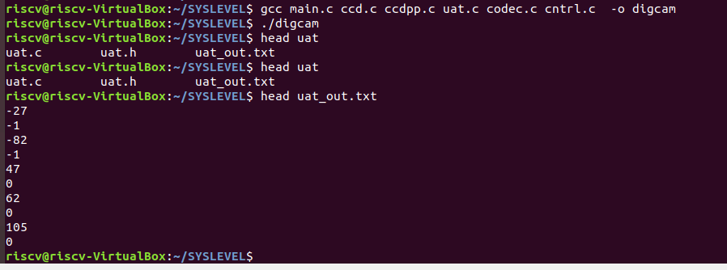
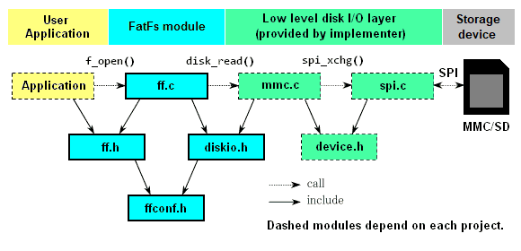
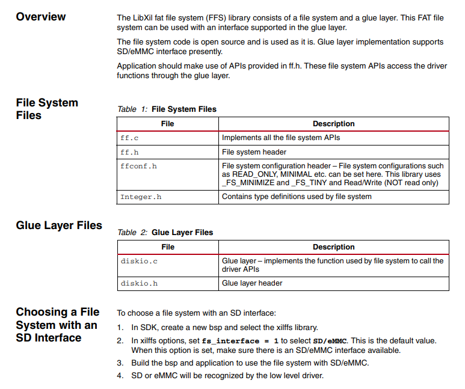
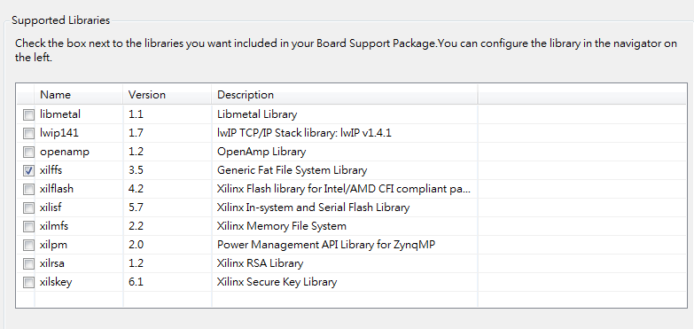
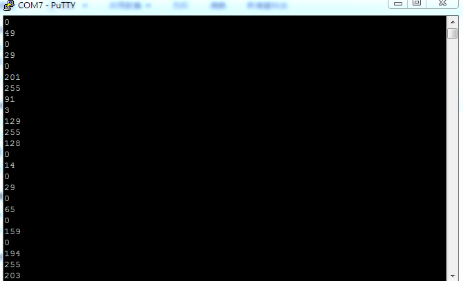
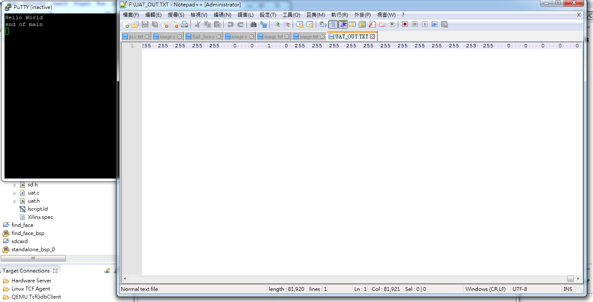

### HW1

用Kruskal–Wallis求圓周率前800有效位
程式碼來自[Computing Pi in C](https://crypto.stanford.edu/pbc/notes/pi/code.html)Computing Pi in C

```c
#include <stdio.h>

int main() {
    int r[2800 + 1];
    int i, k;
    int b, d;
    int c = 0;

    for (i = 0; i < 2800; i++) {
        r[i] = 2000;
    }

    for (k = 2800; k > 0; k -= 14) {
        d = 0;

        i = k;
        for (;;) {
            d += r[i] * 10000;
            b = 2 * i - 1;

            r[i] = d % b;
            d /= b;
            i--;
            if (i == 0) break;
            d *= i;
        }
        printf("%.4d", c + d / 10000);
        c = d % 10000;
    }

    return 0;
}
```


```c=
void line_12(){
	r[i] = 2000;
}

void line_22(){
	d += r[i] * 10000;
}

void line_23(){
	b = 2 * i - 1;
}

void line_24(){
	r[i] = d % b;
    d /= b;
}

void line_27(){
	c = d % 10000;
}

```



很明顯是line_24()，我想做記憶體線性存取加速。

### HW2

#### 本機編譯



本來不知道.h.c檔只有單向include，一直在嘗試-I -L


直接傳給gcc秒解。
我還是搞不懂gcc target file 跟 -I的差別

#### 讀寫SD

先上結論


```c=
//FIleIo/diskio.h
/*---------------------------------------*/
/* Prototypes for disk control functions */

int assign_drives (int, int);
DSTATUS disk_initialize (BYTE);
DSTATUS disk_status (BYTE);
DRESULT disk_read (BYTE, BYTE*, DWORD, BYTE);
DRESULT disk_write (BYTE, const BYTE*, DWORD, BYTE);
DRESULT disk_ioctl (BYTE, BYTE, void*);

```

好像有實作disk_write???
但mmc.c裡沒有write

```c=
//ffconf.h
#define _FS_READONLY	1	/* 0:Read/Write or 1:Read only */
/* Setting _FS_READONLY to 1 defines read only configuration. This removes
/  writing functions, f_write, f_sync, f_unlink, f_mkdir, f_chmod, f_rename,
/  f_truncate and useless f_getfree. */
```

vivado會提醒你mmc裡沒有disk_write()
:::danger
所以src裡的FileIo不能用
:::
在google了前5頁多是xilinx 教你自己刻的3年前的論壇之後，我絕望的跑去看xilinx user meue
，發現xilinx做完了[p158 LibXil FFS](https://www.xilinx.com/support/documentation/sw_manuals/xilinx2014_4/oslib_rm.pdf)
本來以為是救贖，結果

二頁XD
後來發現[FatFs](http://elm-chan.org/fsw/ff/00index_e.html)是他的最頂層接口

```c=
#include <stdio.h>
#include "platform.h"
#include "xil_printf.h"
#include "xstatus.h"

#include "ff.h"

u32 FlashReadBaseAddress;


static FIL fil;		/* File object */
static FATFS fatfs;
static char buffer[32];
static char *boot_file = buffer;

char *strcpy_rom(char *Dest, const char *Src)
{
	unsigned i;
	for (i=0; Src[i] != '\0'; ++i)
		Dest[i] = Src[i];
	Dest[i] = '\0';
	return Dest;
}

u32 InitSD(const char *filename)
{

	FRESULT rc;

	/* Register volume work area, initialize device */
	rc = f_mount(&fatfs,2,1);
	//fsbl_printf(DEBUG_INFO,"SD: rc= %.8x\n\r", rc);

	if (rc != FR_OK) {
		return XST_FAILURE;
	}

	strcpy_rom(buffer, filename);
	boot_file = (char *)filename;
	FlashReadBaseAddress = XPAR_PS7_SD_0_BASEADDR;

	rc = f_open(&fil, boot_file, FA_READ);
	if (rc) {
		xil_printf("SD: Unable to open file %s: %d\n", boot_file, rc);
		//fsbl_printf(DEBUG_GENERAL,"SD: Unable to open file %s: %d\n", boot_file, rc);
		return XST_FAILURE;
	}

	return XST_SUCCESS;

}

u32 SDAccess( u32 SourceAddress, u32 DestinationAddress, u32 LengthBytes)
{

	FRESULT rc;	 /* Result code */
	UINT br;

	rc = f_lseek(&fil, SourceAddress);
	if (rc) {
		xil_printf("SD: Unable to seek to %x\n", SourceAddress);
		//fsbl_printf(DEBUG_INFO,"SD: Unable to seek to %x\n", SourceAddress);
		return XST_FAILURE;
	}

	rc = f_read(&fil, (void*)DestinationAddress, LengthBytes, &br);

	if (rc) {
		//fsbl_printf(DEBUG_GENERAL,"*** ERROR: f_read returned %d\r\n", rc);
		xil_printf("*** ERROR: f_read returned %d\r\n", rc);
	}

	return XST_SUCCESS;

} /* End of SDAccess */


void ReleaseSD(void) {

	f_close(&fil);
	return;


}

int main()
{
	char imageval[128];

	disable_caches();
	InitSD("image.txt");
	SDAccess(0,(u32)imageval,32);
	xil_printf("%s\n\r",imageval);
	enable_caches();
    init_platform();

    print("Hello World\n\r");

    cleanup_platform();
    return 0;
}

```

#### 只讀



```c=
void enable_caches();  //ericchen add 2020/01
void disable_caches();  //ericchen add 2020/01
```

```c=
void CcdCapture(void) {

    int pixel;
    char pixelbuff[8];
    disable_caches();
    InitSD(imageFileName);
    for(rowIndex=0; rowIndex< SZ_ROW; rowIndex++) {

        for(colIndex=0; colIndex< SZ_COL; colIndex++) {
        	SDAccess(rowIndex*(5*SZ_COL+2)+colIndex*5,(u32)pixelbuff,5);
        	pixelbuff[5] = '\0';
            if( sscanf(pixelbuff, "%i", &pixel) == 1 ) {

                assert( pixel >= -128 && pixel <= 127 );

                buffer[rowIndex][colIndex] = (char)pixel;
                //xil_printf("%d",pixel);
            }
            else {

                assert( 0 );
            }
        }
        //xil_printf("\n\r");
    }
    enable_caches();
    ReleaseSD();
    rowIndex = 0;
    colIndex = 0;
}
```

:::info
D:\10510129\hw2_0\lab5.sdk\digcam\Debug/../src/sd.c:140: multiple definition of `SDAccess' ./src/helloworld.o:D:\10510129\hw2_0\lab5.sdk\digcam\Debug/../src/sd.c:140: first defined here ./src/sd.o: In function `ReleaseSD':
D:\10510129\hw2_0\lab5.sdk\digcam\Debug/../src/sd.c:176: multiple definition of `ReleaseSD'
./src/helloworld.o:D:\10510129\hw2_0\lab5.sdk\digcam\Debug/../src/sd.c:176: first defined here
collect2.exe: error: ld returned 1 exit status
make: *** [digcam.elf] Error 1

22:34:45 Build Finished (took 377ms)
:::
好像一定要.h


#### 讀寫

```c=
//sd.c
#include <stdio.h>

#include "xil_printf.h"
#include "platform.h"
#include "xstatus.h"

#include "ff.h"
#include "sd.h"


static FIL fil;		/* File object */
static FATFS fatfs;
static char buffer[32];
static char *boot_file = buffer;

u32 FlashReadBaseAddress;  //不知名原應要出現

char *strcpy_rom(char *Dest, const char *Src)//意義不明
{
	unsigned i;
	for (i=0; Src[i] != '\0'; ++i)
		Dest[i] = Src[i];
	Dest[i] = '\0';
	return Dest;
}


u32 InitSD(const char *filename,int mode)
{

	BYTE imode = mode == 0 ? FA_READ : FA_WRITE | FA_CREATE_ALWAYS;
	FRESULT rc;
	rc = f_mount(&fatfs,"",0);//sync 0

	if (rc != FR_OK) {
		return XST_FAILURE;
	}

	strcpy_rom(buffer, filename);
	boot_file = (char *)filename;
	FlashReadBaseAddress = XPAR_PS7_SD_0_BASEADDR;

	rc = f_open(&fil, boot_file, imode);
	if (rc) {
		xil_printf("SD: Unable to open file %s: %d\n", boot_file, rc);
		return XST_FAILURE;
	}

	return XST_SUCCESS;

}


u32 SDAccess( u32 SourceAddress, u32 DestinationAddress, u32 LengthBytes)
{

	FRESULT rc;	 /* Result code */
	UINT br;

	rc = f_lseek(&fil, SourceAddress);
	if (rc) {
		xil_printf("SD: Unable to seek to %x\n", SourceAddress);
		return XST_FAILURE;
	}

	rc = f_read(&fil, (void*)DestinationAddress, LengthBytes, &br);

	if (rc) {
		//fsbl_printf(DEBUG_GENERAL,"*** ERROR: f_read returned %d\r\n", rc);
		xil_printf("*** ERROR: f_read returned %d\r\n", rc);
	}

	return XST_SUCCESS;

} /* End of SDAccess */


u32 SDWrite(const char* wbuff, u32 LengthBytes)
{

	FRESULT rc;	 /* Result code */
	UINT br;
	rc = f_write(&fil, (const void*)wbuff,LengthBytes,&br);
	if (rc) {
		
		xil_printf("*** ERROR: f_write returned %d\r\n", rc);
	}

	return XST_SUCCESS;

} /* End of SDAccess */


void ReleaseSD(void) {

	f_close(&fil);
	f_mount(0,"",0); //unmount
	return;


}
```

```c=
//uat.c
void UatInitialize(const char *outputFileName) {
    assert( outputFileName );
    disable_caches();
    InitSD(outputFileName,1);
}

void UatSend(char d) {
    
    sprintf(outputFilebuff, "%5i\n\r", (int)d); 
	SDWrite((void*)outputFilebuff,5); //懒的算長度
}

void UatRelease(){ //一定要關不然會寫入不全，雖然我sync沒開
	ReleaseSD();
}
```

```c=
//ccd.c
void CcdCapture(void) {

    int pixel;
    char pixelbuff[8];
    disable_caches();
    InitSD(imageFileName,0);
    for(rowIndex=0; rowIndex< SZ_ROW; rowIndex++) {

        for(colIndex=0; colIndex< SZ_COL; colIndex++) {
        	SDAccess(rowIndex*(5*SZ_COL+2)+colIndex*5,(u32)pixelbuff,5);
        	pixelbuff[5] = '\0';
            if( sscanf(pixelbuff, "%i", &pixel) == 1 ) {

                assert( pixel >= -128 && pixel <= 127 );

                buffer[rowIndex][colIndex] = (char)pixel;
                //xil_printf("%d",pixel);
            }
            else {

                assert( 0 );
            }
        }
        //xil_printf("\n\r");
    }
    ReleaseSD();
    enable_caches();

    rowIndex = 0;
    colIn
```

```c=
int main()
{
    init_platform();
    char *uatOutputFileName = "uat_out.txt";
    char *imageFileName = "image.txt";
    print("Hello World\n\r");
    CcdInitialize(imageFileName);
    CcdppInitialize();
    CodecInitialize();
    CntrlInitialize();

    CntrlCaputreImage();
    CntrlCompressImage();
    UatInitialize(uatOutputFileName);
    CntrlSendImage();
    UatRelease();
    print("end of main\n\r");
    cleanup_platform();
    return 0;
}
```

換順序

