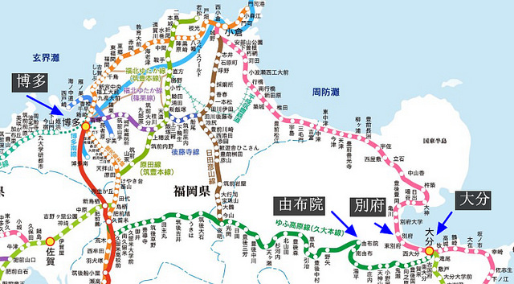
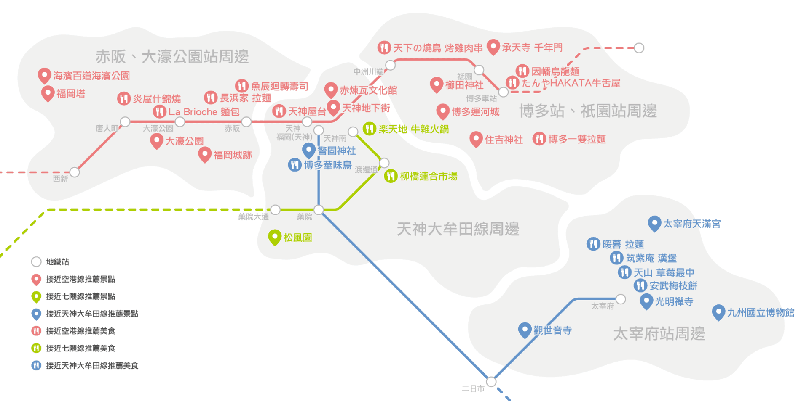
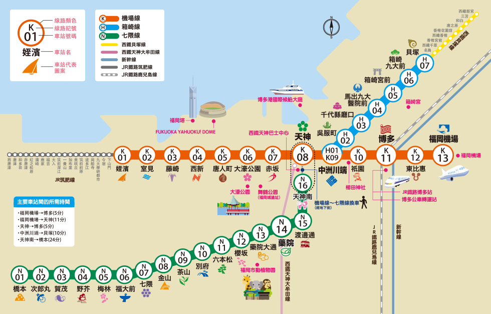
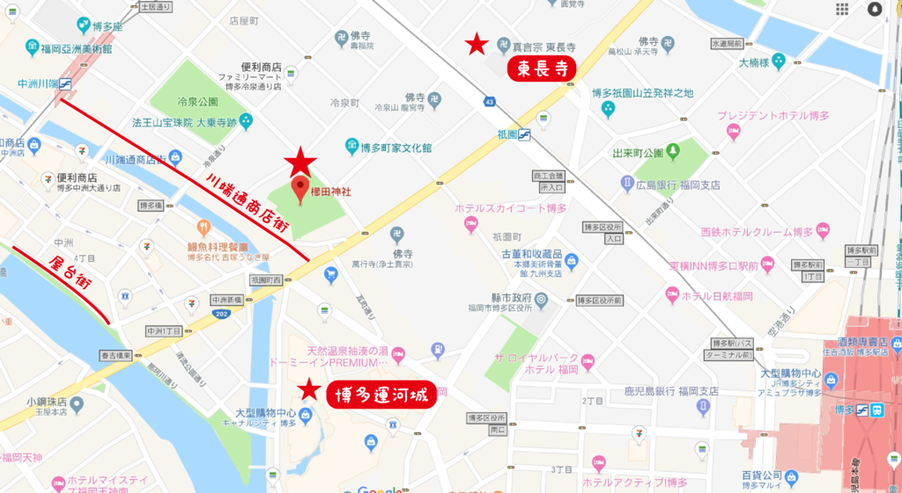
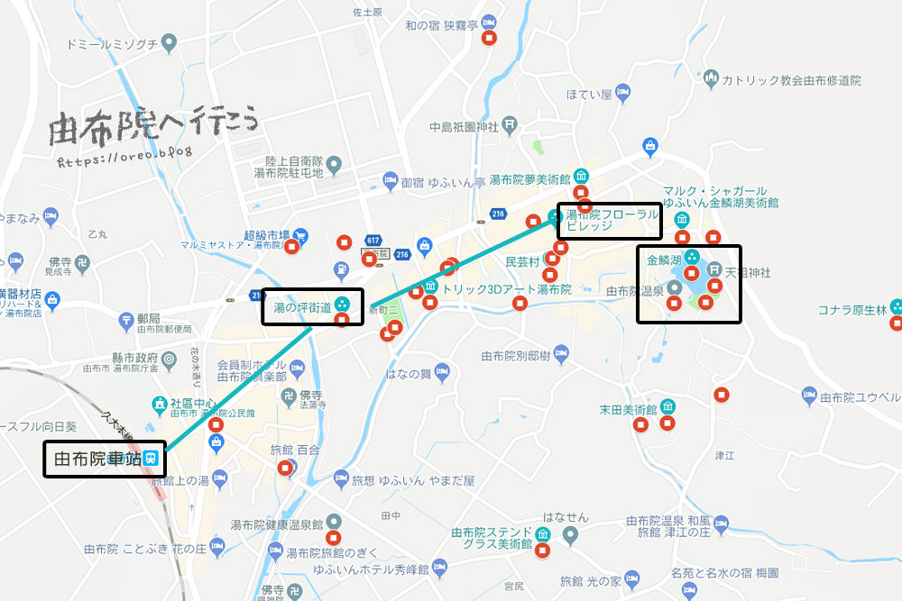
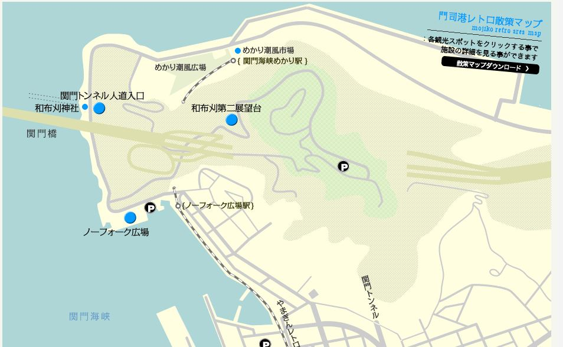
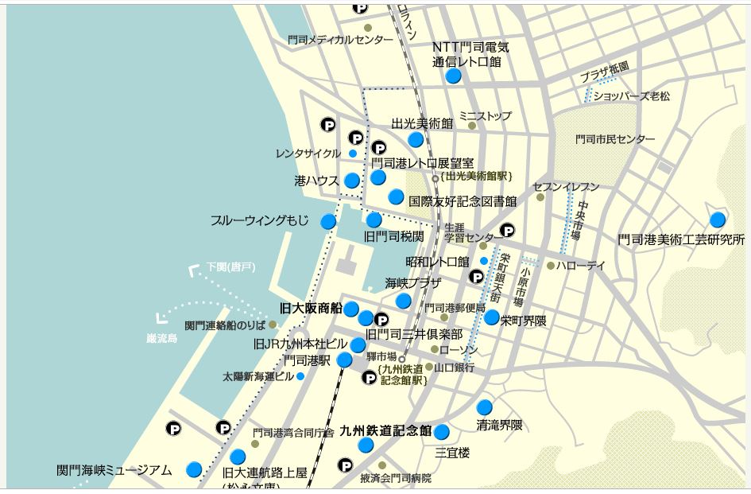
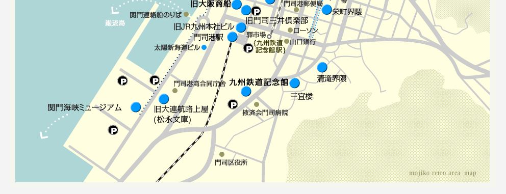
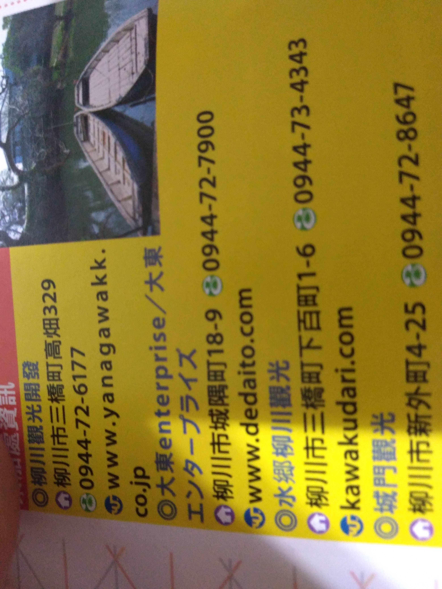

### 福岡市

> 用地鐵移動

[地圖](https://drive.google.com/open?id=1J0VswzNKXyluHb9Pkv5qo4Wq17yy8D_y&amp;usp=sharing)

[博多もつ鍋 おおやま](https://www.motu-ooyama.com/)(連鎖)
[鈴懸(甜點)](https://www.suzukake.co.jp/tenpo/honten.html)
[GURUNAVI(高級餐廳指南)](ttps://gurunavi.com/zh-hant/all/fukuoka/am_aream5052)

#### 博多尺

> 車站附近的百貨公司

1. 櫛田神社 福岡市博多区上川端町1-41
2. 承天寺 福岡県福岡市博多区博多駅前１丁目２９−９
3. 百貨公司附近很多(博多尺)
4. たんやHAKATA(早餐) 博多車站美食街內
5. 葉隠うどん 福岡県福岡市博多区博多駅南2-3-32 (Bib Gourmand)
6. うどん平 (11:30～15:00)(092-431-9703)福岡縣福岡市博多区博多駅前 3-17-10
7. 豚ステーキ 十一(豬排) 福岡県福岡市博多区博多駅南3-6-20

#### 中洲

[屋台](http://yatai.fukuoka.jp/nakasu)

1. 一蘭福岡總店 福岡市博多区中洲5-3-2 ()
2. とりまぶ水炊き 福岡県福岡市博多区 中洲 5-3-18 Tm-16ビル1F
3. 麺道はなもこし 福岡縣福岡市中央區葯院 2-4-35
4. 柳橋聯合市場 福岡県福岡市中央区春吉１丁目６ 春吉1丁目5番
5. 吉塚鰻魚 福岡縣福岡市博多區中洲 2-8-27
6. 庵道珈琲天神店 福岡県福岡市中央区天神２丁目１４−38

#### 大豪

1. 大濠公園 福岡縣福岡市中央區大濠公園1−２
2. 福岡城跡 福岡縣福岡市中央區城内1
3. フランス菓子16区 福岡県福岡市中央区薬院４丁目２０−１０

### 由布院

1. 史奴比茶屋 大分県由布市湯布院町川上1524-27
2. YUFUIN FLORAL VILLAGE 大分県由布市湯布院町川上1503-3
3. LA RUCHE 大分県由布市 湯布院町川上岳本1592−1(金鱗湖畔)

> 甜點咖啡廳
> JR鹿耳島九大本線 (90分鐘)
> 用走的
> 

### 門司港，下關

> http://www.mojiko.info/spot/index.html
> JR鹿耳島本線
> 搭船到下關(門司港桟橋（マリンゲートもじ）)
> 日歐混和的洋式建築

> > 門司港車站
> > 舊大阪商船大樓
> > 舊門司三井俱樂部
> > 北九州市立國際友好紀念圖書館
> > 舊門司海關
> > 門司港レトロ展望室
> > 藍翼橋

1. 唐戶市場 山口県下関市唐戸町5−50
2. 赤間神宮 山口県下関市阿弥陀寺町4-1
3. 伽喱本舖 北九州市門司区港町9-2 阿波屋ビル2F

### 小倉

1. 小倉城 福岡県北九州市小倉北区城内２−１
2. 旦過市場 福岡県北九州市小倉北区魚町４丁目２−18

> http://www.chugin.or.jp/

### 佐賀

1. 佐賀懷舊館 佐賀市城内2-8-8
2. 

> JR長崎線，佐世保線，唐津線

> #### 佐賀市

> https://drive.google.com/open?id=1KqcixQyM-5z9K-XIHKt3JaIa8OqdhOyj&usp=sharing
> 有市區電車
> 酒釀

#### 有田町

1. 有田一番館 佐賀県西松浦郡有田町本町丙972-32
2. KILN ARITA觀光案內所 佐賀県西松浦郡有田町本町丙972- 31
3. 皿山通(道路)
4. アリタセラ / Arita Será 佐賀県西松浦郡有田町赤坂丙2351番地170
5. 佐賀縣立九州陶瓷文化館 佐賀県西松浦郡有田町戸杓乙3100-1
6. 陶山神社 佐賀県西松浦郡有田町大樽2-5-1
7. 香蘭社 佐賀県西松浦郡有田町幸平1丁目3番8号

> 陶器
> 車站附近逛
> JR佐世保線 有田尺
> 租腳踏車

### 柳川

博多運河城

> > JR在二日市轉往太宰府
> > 西鐵柳川尺下車

1. 遊船 (走回柳川尺，有接駁車到乘船口)
2. 元祖本吉屋 柳川市旭町69
3. [皿屋　福柳](http://www.saraya-fukuryu.com/shopinfo.html)福岡県柳川市沖端町２９－１

### 太宰府

1. 太宰府天滿宮 福岡県太宰府市宰府４丁目７−１
2. 太宰府星巴客 福岡県太宰府市宰府３丁目２−40

估計
1/30
1/31
2/1 市區
2/2 佐賀
2/3 門司
2/4 太宰府
2/5 游不院
2/6
