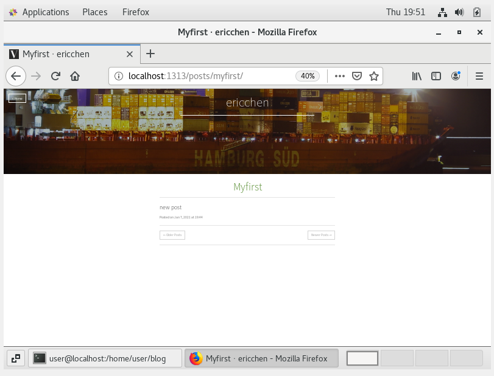

### install

先去[copr](https://copr.fedorainfracloud.org/coprs/daftaupe/hugo/)裝hugo官方的repo

```shell=
yum install hugo
```

應該就有hugo可以用了
2025 Ubuntu 24 Apt 安裝版本為 0.123.7; Githab last is 0.143.1, 有些 theme 可不能用

Hugo is available in three editions: standard, extended, and extended/deploy.
至少要 extended 才有 Webp 及 SASS

### 使用

裝theme

```shell=
git clone https://github.com/hauke96/hugo-theme-hamburg.git themes/hamburg
```

改設定檔

```
baseURL = "http://example.org/"
languageCode = "en-us"
title = "ericchen"
theme = "hamburg"

```

```shell=
hugo new site blog
cd blog
hugo new posts/myfirst.md
hugo                       #生成網頁
hugo server -D
```

myfirst應該會出現在content下面


### [hugo-theme-next](https://github.com/hugo-next/hugo-theme-next/tree/main)

用 [hugo-theme-next-starter](https://github.com/hugo-next/hugo-theme-next-starter) 開始，自己建 site 會 build 不過

### ref

https://coolgood88142.github.io/zh-tw/posts/hugo/
